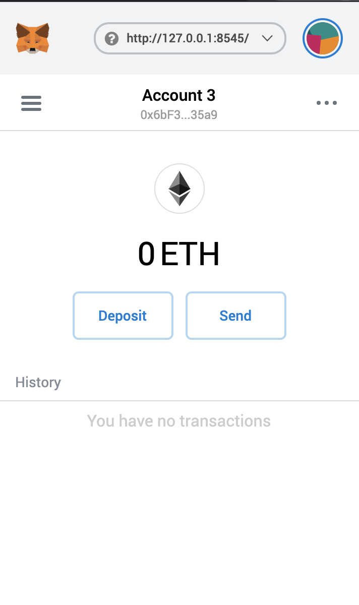
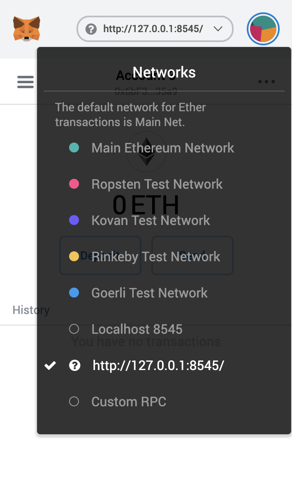
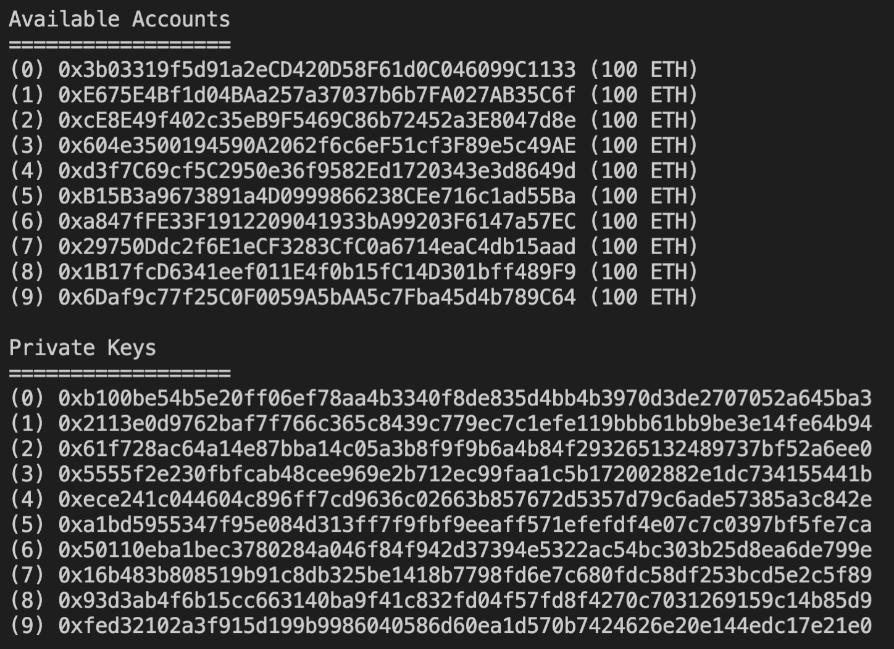
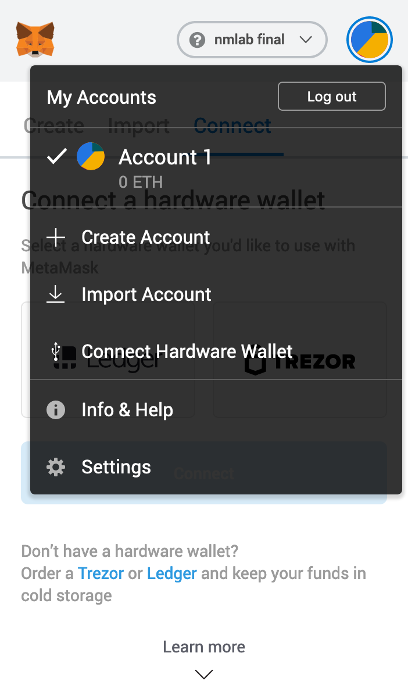
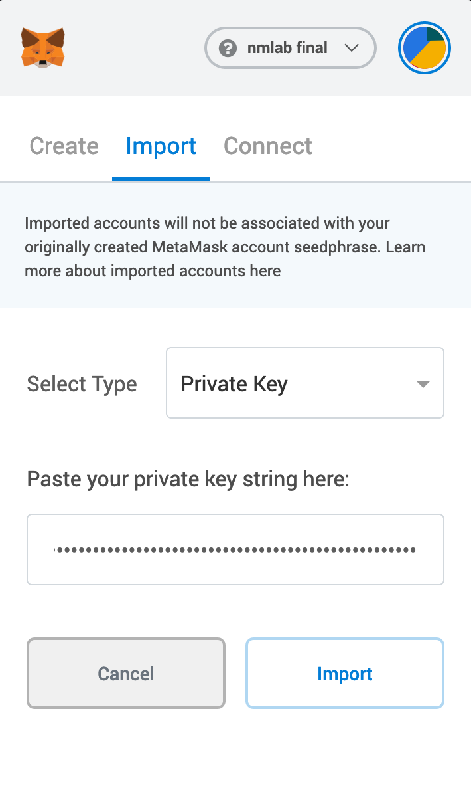
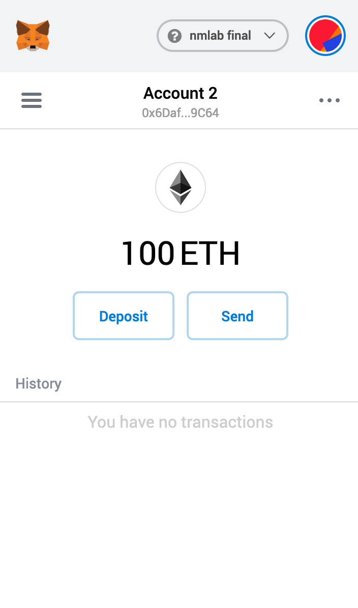

# 108-2 NMLAB Final
## DPP - Decentralized Publishing Platform
- 電機四 b05901033 莊永松
- 電機四 b05901189 吳祥叡
- 電機三 b06901104 趙崇皓
## Prerequisites
Make sure the follwing npm packages are installed globally:
```
├── ganache-cli@6.9.1
└── truffle@5.1.24
```
For browsers, you can use **Chrome** and **Firefox**. Make sure that **Metamask** is installed as a plugin in the browser.

## How to
### Starting a local blockchain
In the top level folder, start the ganache-cli:
```
> ganache-cli
```
A local blockchain network `http://127.0.0.1:8545` will be created.

Open another terminal (or you could use tmux), type the following commands:
```
> truffle compile
> truffle migrate
```
### Starting local client
Navigate to `client` folder, and type:
```
> yarn start
```
You can now go to `localhost:3000` to visit the webpage.

### Connecting Metamask to local network

After starting a local blockchain network and client webpage, we need to connect the browser's Metamask account (assuming you already have one) to the local blockchain network.

|Step|Snapshot|
|---|---|
|Open your browser, and click on the Metamask icon.||
|Click the dropdown list on the top. You should see a list of networks.||
|Choose **Custom RPC** and, and set RPC url to `http://127.0.0.1:8545/`(default), or the url ganache-cli specifies.||

### Importing accounts
After starting `ganache-cli`, you will have some spare accounts to use:



Suppose we want the use account no. 9:

|Step|Snapshot|
|---|---|
|Click on Metamask and select the icon on the top-right. Click on **Import Account**.||
|Copy the private key of account you wish to use and paste it in Metamask.||
|Click **Import** and see account successfully loaded.||

### Setting up ipfs node
Currently, we have an ipfs node running on our own server. However, you can also run a ipfs node locally:
```
> docker run -it -p 4002:4002 -p 4003:4003 -p 5002:5002    -p9090:9090 ipfs/js-ipfs:latest
```
After starting your own ipfs node, you need to modify `IPFS_ADDRESS` in `client/src/constants.js`. Currently, it is set to our current server address. If you run locally, you need to set it to `127.0.0.1`.

### Features

- Modify account information (Account)
- Upload files (Upload)
    - Currently supports `.txt`, `.pdf`, and image filetypes.
    - Aside from the original file, the webpage will also upload a preview file (blurred image, truncated pdf file) to the ipfs node.
- Check user's uploaded files and files users donated to (MyFeeds).
    - You can download the full file by clicking **Download**.
- Browse all files on the chain (Market).
    - Currently supports filter by filename and filetype.
    - You can preview the file by clicking on the file card.
    - You can donate money to the author of the file.